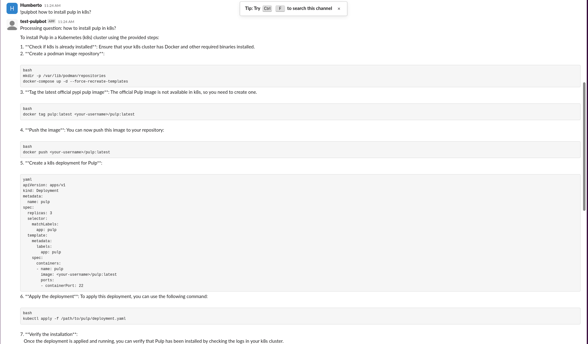

In this blog post, I want to share my adventures trying to learn how to write a chatbot to help with Pulp.

---

### DISCLAIMER  
I had no previous knowledge of large language models (LLMs) or AI in general, so please keep in mind that some (or maybe most) of what I describe might be incorrect.

---

## Getting Started: Discovering RAG and LLMs

After watching some YouTube videos on creating chatbots with custom data, I learned that I would need to use Retrieval-Augmented Generation (RAG) to enhance existing LLMs with my own data. To explore this further, I asked [Perplexity.ai](https://perplexity.ai) how to do it. They provided a sample using [LangChain](https://github.com/langchain-ai/langchain) with OpenAI’s GPT models. However, since I don’t have an OpenAI API subscription, I couldn’t make it work.

Digging deeper, I discovered I could use [LlamaIndex](https://www.llamaindex.ai) together with [Ollama](https://ollama.com) through the [LlamaIndex Ollama LLM integration](https://docs.llamaindex.ai/en/stable/examples/llm/ollama/). LlamaIndex helps load, structure, and index your data, allowing the LLM to retrieve relevant information from your custom data sources during conversations, improving accuracy and relevance.


## Experimenting with Ollama and Models

As a first step, I experimented with Ollama using the [deepseek-r1](https://github.com/ollama/ollama?tab=readme-ov-file#model-library) model because my GPU (RTX 5060) has only 8GB of memory. Although it took a long time, the program ran successfully.

Next, I tested lighter models:

- **gemma3:1b** (1 billion parameters, 815MB)  
- **llama3.2:1b** (1 billion parameters, 1.3GB)

These models required less memory, ran faster, and produced similar outputs. However, for all models tested, the answers were very wrong (sometimes based on outdated Pulp 2 content, sometimes giving puppet commands, or even non-working results).


## Introducing RAG with Pulp Documentation

To improve accuracy, I moved on to testing RAG. I configured my code to use LlamaIndex to load, structure, and index Pulp documentation. Thanks to @pbrochado, I received a "dump" (repomix) of Pulp docs to use.

I tested with **deepseek-r1** and **llama3.2:1b** models. I had issues with **gemma3** because it seems not to support embeddings (numerical vector representations of text used for retrieval).

Here is a snippet of the code I used:

```python
model = "llama3.2:1b"
llm = Ollama(
    model=model,
    request_timeout=120.0,
    context_window=16000,
)

# ensures the model is used as the underlying language model for generating embeddings
Settings.llm = llm
Settings.embed_model = OllamaEmbedding(
    model_name=model,
    base_url="http://localhost:11434",  # default Ollama local server URL
    ollama_additional_kwargs={"mirostat": 0},  # optional parameters
)

# Load pulp docs and create a vector index
documents = SimpleDirectoryReader("./docs").load_data()
index = VectorStoreIndex.from_documents(documents)
query_engine = index.as_query_engine()
```

This time, the chatbot’s answers improved slightly — they were less outdated — but still totally incorrect.


## Building a Slack Bot Interface

Finally, I set up a Slack bot as an interface to interact with the LLM. Since this part is outside the AI topic, I won’t go into details here.

Below are some screenshots showing example questions and answers from the chatbot:  




---

This journey taught me a lot about the challenges of building domain-specific chatbots with current LLM tools.
I hope sharing my experience helps others starting on similar paths!

The source code of this experiment with the instructions to run it can be found in: https://github.com/git-hyagi/pulp-bot
